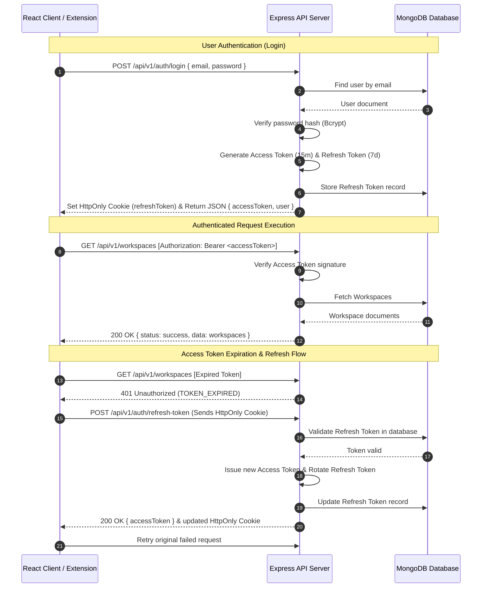

# SessionVault - Enterprise Architecture Blueprint & Technical Specification

## 1. System Vision & Overview
**SessionVault** is an industrial-grade Browser Workspace Manager designed for power users, developers, researchers, and remote teams. It empowers users to capture open browser windows and tabs as organized, named workspaces, sync them across devices in real-time, search through historical browser contexts, share sessions via secure encrypted links, and restore exact browsing environments with a single click.

---

## 2. Technology Stack & Architectural Justifications

| Tier | Technology | Purpose & Justification |
| :--- | :--- | :--- |
| **Frontend Framework** | **React 19 + TypeScript + Vite** | Provides sub-millisecond hot module replacement, strong type safety, zero runtime overhead, and scalable UI component modeling suitable for complex dashboard state. |
| **Styling & Design System** | **Tailwind CSS + shadcn/ui + Framer Motion** | Utility-first styling for pixel-perfect design, dark mode, accessible primitives via Radix UI, and smooth hardware-accelerated animations. |
| **State & Async Data** | **TanStack Query (v5) + Axios** | Declarative asynchronous state management, automatic caching, background revalidation, optimistic updates, and automatic retry policies. |
| **Backend Runtime** | **Node.js + Express + TypeScript** | Asynchronous non-blocking event-driven I/O engine ideal for handling concurrent REST requests, WebSocket sessions, and streaming authentication flows. |
| **Database & ODM** | **MongoDB + Mongoose ODM** | Schemaless document storage perfectly matching deeply nested tab structures, dynamic metadata (favicons, scroll positions, tab groups), indexed text search, and high-speed JSON queries. |
| **Authentication & Security** | **JWT + Refresh Tokens (HttpOnly Cookie) + Bcrypt + Helmet** | Enterprise dual-token security architecture with short-lived access tokens (15m) and persistent refresh tokens stored in HttpOnly, SameSite cookies. Hardened with security headers via Helmet, rate limiting, and CORS safeguards. |
| **Real-time Engine** | **Socket.io** | Full-duplex WebSocket communication enabling real-time tab synchronization across open browser windows and collaborative workspace updates. |
| **Browser Extension** | **Manifest V3 (Chrome Extension API)** | Modern background service worker, Chrome Tabs API for window inspection, Storage API for offline resilience, and Context Menus for 1-click workspace saving. |

---

## 3. High-Level Architecture Diagram

```mermaid
graph TD
    subgraph Client Tier
        CE[Chrome Extension (Manifest V3)]
        WA[React Web Application (Vite + TS)]
    end

    subgraph API Gateway & Middleware Tier
        H[Helmet Security Headers]
        RL[Express Rate Limiter]
        C[CORS Config]
        M[Morgan Logger]
        AUTH[JWT Authentication Middleware]
    end

    subgraph Business Logic & Service Tier
        CTRL[Express Controllers]
        VAL[Zod / Joi Validation Layer]
        SVC[Domain Services]
        REPO[Repository Pattern Layer]
    end

    subgraph Persistence & Integration Tier
        MDB[(MongoDB Database)]
        SOCKET[Socket.io WebSockets]
        CLD[Cloudinary Storage]
        MAIL[Nodemailer SMTP]
    end

    WA --> H --> RL --> C --> M --> AUTH --> CTRL
    CE --> H --> RL --> C --> M --> AUTH --> CTRL
    CTRL --> VAL --> SVC --> REPO --> MDB
    SVC --> SOCKET
    SVC --> CLD
    SVC --> MAIL
```

---

## 4. Entity-Relationship (ER) Diagram

```mermaid
erDiagram
    USERS ||--o{ WORKSPACES : owns
    USERS ||--o{ REFRESH_TOKENS : issues
    WORKSPACES ||--o{ FOLDERS : contains
    WORKSPACES ||--o{ TABS : includes
    WORKSPACES ||--o{ SHARED_LINKS : creates
    FOLDERS ||--o{ TABS : organizes

    USERS {
        ObjectId _id PK
        string email UK
        string passwordHash
        string fullName
        string avatarUrl
        boolean isEmailVerified
        string emailVerificationToken
        string resetPasswordToken
        date resetPasswordExpires
        date createdAt
        date updatedAt
    }

    REFRESH_TOKENS {
        ObjectId _id PK
        ObjectId userId FK
        string token UK
        string userAgent
        string ipAddress
        date expiresAt
        date createdAt
    }

    WORKSPACES {
        ObjectId _id PK
        ObjectId userId FK
        string title
        string description
        string color
        string icon
        string[] tags
        boolean isFavorite
        boolean isPinned
        boolean isArchived
        boolean isTrash
        date trashDate
        int tabCount
        date createdAt
        date updatedAt
    }

    FOLDERS {
        ObjectId _id PK
        ObjectId workspaceId FK
        ObjectId userId FK
        string name
        string color
        int position
        date createdAt
    }

    TABS {
        ObjectId _id PK
        ObjectId workspaceId FK
        ObjectId folderId FK
        string title
        string url UK_IN_WORKSPACE
        string favIconUrl
        int index
        boolean pinned
        boolean active
        string windowId
        date createdAt
    }

    SHARED_LINKS {
        ObjectId _id PK
        ObjectId workspaceId FK
        ObjectId createdBy FK
        string shareCode UK
        string accessLevel
        string passwordHash
        date expiresAt
        int viewCount
        date createdAt
    }
```

---

## 5. Sequence Diagram: Authentication & Token Refresh Flow



---

## 6. Directory Blueprint & Enterprise Architecture

```
SessionVault/
├── client/                     # React Frontend App (Vite + TS + Tailwind + shadcn/ui)
│   ├── public/
│   │   └── favicon.svg
│   ├── src/
│   │   ├── assets/
│   │   ├── components/         # Reusable UI primitives & layouts
│   │   │   ├── ui/             # shadcn/ui low-level components (Button, Modal, Toast, Input)
│   │   │   ├── common/         # Navbar, Sidebar, LoadingSkeleton, EmptyState, DarkModeToggle
│   │   │   └── modules/        # Feature-specific UI components (WorkspaceCard, TabList, ShareModal)
│   │   ├── contexts/           # AuthContext, ThemeContext, SocketContext
│   │   ├── hooks/              # Custom Hooks (useAuth, useWorkspaces, useTabs, useDebounce)
│   │   ├── layouts/            # DashboardLayout, AuthLayout, RootLayout
│   │   ├── pages/              # Login, Register, Dashboard, WorkspaceDetails, Folders, Shared, Settings
│   │   ├── routes/             # AppRoutes, ProtectedRoute, GuestRoute
│   │   ├── services/           # Axios API services (auth.service, workspace.service, tab.service)
│   │   ├── store/              # Global state management
│   │   ├── types/              # TypeScript interfaces & types (User, Workspace, Tab, SharedLink)
│   │   ├── utils/              # Helper functions, constants, formatting
│   │   ├── App.tsx
│   │   ├── main.tsx
│   │   └── index.css           # Design tokens, Tailwind CSS, dark mode root variables
│   ├── index.html
│   ├── package.json
│   ├── tsconfig.json
│   └── vite.config.ts
│
├── server/                     # Express Backend REST API & Real-time WebSockets
│   ├── src/
│   │   ├── config/             # Environment setup, database connection, Cloudinary, Nodemailer, Swagger
│   │   ├── controllers/        # Request handlers (AuthController, WorkspaceController, TabController)
│   │   ├── middleware/         # Auth, Error Handling, Rate Limiter, Validation, Security, Upload
│   │   ├── models/             # Mongoose schemas & TypeScript interfaces
│   │   ├── repositories/       # Data Access Layer (UserRepository, WorkspaceRepository, TabRepository)
│   │   ├── routes/             # API routes definition (v1/auth, v1/workspaces, v1/tabs, v1/shared)
│   │   ├── services/           # Core Business Logic (AuthService, WorkspaceService, TabService, EmailService)
│   │   ├── sockets/            # Socket.io event handlers & workspace sync
│   │   ├── utils/              # ApiError, ApiResponse, AsyncHandler, Logger, JwtTokens
│   │   ├── validators/         # Zod schemas for request validation
│   │   ├── app.ts              # Express application setup
│   │   └── server.ts           # Server entry point with HTTP & WebSockets
│   ├── .env.example
│   ├── package.json
│   ├── tsconfig.json
│   └── swagger.json
│
├── extension/                  # Chrome Extension (Manifest V3)
│   ├── manifest.json           # Manifest configuration
│   ├── background/             # Background Service Worker
│   │   └── background.js
│   ├── popup/                  # Extension Popup Interface
│   │   ├── popup.html
│   │   ├── popup.js
│   │   └── popup.css
│   ├── icons/                  # Extension icons (16, 48, 128)
│   └── options/                # Settings / Options page
│       ├── options.html
│       └── options.js
│
└── docs/                       # Enterprise Documentation & Postman
    ├── architecture_blueprint.md
    ├── postman_collection.json
    └── swagger.yaml
```
